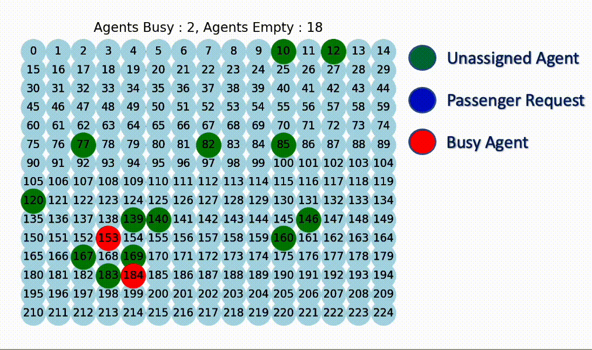

# An Enhanced ADP Approach to On-demand Ride Pooling

This repository provides complementary code for the paper [An Enhanced Approximate Dynamic Programming Approach to On-demand Ride Pooling](https://arxiv.org/pdf/2305.12028.pdf). 

This study focuses on enhancing ride-pooling services through an advanced Approximate Dynamic Programming (ADP) model, comparing it with the Neural Approximate Dynamic Programming ([NeurADP](https://arxiv.org/pdf/1911.08842.pdf)) approach. Key extensions in the ADP model include handling pick-up/drop-off deadlines, vehicle rebalancing, and accommodating more than two passengers per vehicle. Using datasets from New York City and Chicago taxis, we perform a detailed analysis, examining factors like wait times, passenger group sizes, and vehicle capacity. Sensitivity to these factors and the impact of vehicle rebalancing are also explored. Our findings reveal that while NeurADP excels in larger, complex scenarios by better learning value function approximations, ADP is more effective in smaller settings. The study highlights the varying performances influenced by network density and road directionality.

<p align="center">

</p>

## Repository Structure
* `data` - Files related to datasets and generating instances of order arrivals. 
	* `prepare_data.py` - Define parameters and execute data preparation. 
	* `prepare_real_data.py` - Prepare data for NYC data on real-world network.
	* `prepare_synthetic_data.py` - Prepare Chicago data for synthetic network. 
	* `DataGenerator.py` - Class to generate simulated data for requests.
	* `Order.py` - Class representing a request order.
	* `real_dataset` - Files related to NYC data.
	* `synthetic_dataset` - Files related to Chicago data.
* `ADP` - Contains main set of code for running simulations.
	* `run.py` - Main code for running simulations and defining parameters.
	* `CentralAgent.py` - Central agent class to handle matching orders & agents.
	* `Environment.py` - Environment class in which agents operate.
	* `Driver.py` - A class representing a driver.
	* `Order.py` - Class representing an order.
	* `DataGenerator.py` - Class to generate simulated data for orders.
	* `ValueFunction.py` - ADP class for decision making.
	* `ResultCollector.py` - Class for collecting results from simulation.
* `results` - Used for storing the outcomes of simulations.
* `plots` - Figures relating to experiment results.
* `requirements.txt` - Requirements file for installation.

## Simulation Parameters
There are several variables which may be tuned when running the simulations. Below I provide a table of the parameter, their description, the default value, and the choices.

| Parameter | Description | Data Type | Default | Choices |
|--------------|-------------|-------------|-------------|-------------|
|***n***|Number of vehicles|***int***|20|&ge; 0|
|***wt***|Maximum wait-time allowed|***float***|90.0|&ge; 0.0|
|***dt***|Maximum delay-time allowed|***float***|90.0|&ge; 0.0|
|***vehicle_cap***|Maximum allowed vehicle capacity|***int***|4|&ge; 0|
|***locs_to_visit***|Maximum number of groups allowed|***int***|2|&ge; 0|
|***vehicle_cap***|Maximum allowed vehicle capacity|***int***|3|[0,1,2...]|
|***stepsize***|Type of step-size used (harmonic, fixed, polynomial,bias-adjusted Kalman filter)|***str***|B|[H,F,P,B]|
|***levels***|Number of levels for hierarchical aggregation|***int***|4|[1,2,3,4]|
|***rebalancing***|Rebalancing of vehicles allowed|***bin***|1|[1,0]|
|***data_type***|Real of synthetic data used|***str***|real|[real, synthetic]|
|***train_days***|Number of training days used|***int***|1000|&ge; 0|
|***test_days***|Number of testing days used|***int***|20|&ge; 0||

## Installation and Execution Setup
In the following, I will describe how to setup a conda environment, initialise python, download CPLEX, and install necessary packages for setting up the repository in a virtual machine.
### (1) Install Conda
```bash
wget https://repo.anaconda.com/archive/Anaconda3-2021.11-Linux-x86_64.sh
``` 
```bash
bash Anaconda3-2021.11-Linux-x86_64.sh
```
### (2) Create & Access Virtual Environment
Create enviornment named ***adp*** that has ***python 3.6.13*** installed
```bash
conda create -n adp python=3.6.13
```
```bash
conda activate adp
```
### (3) Download Java VM
Download Java Virtual Machine
```bash
sudo apt-get update
```
```bash
sudo apt-get install default-jdk
```
```bash
java -version
```
### (4) Download CPLEX
Visit [CPLEX website](https://www.ibm.com/ca-en/products/ilog-cplex-optimization-studio) and login using an academic/professional account. Download IBM ILOG CPLEX Optimization Studio bin file called ***cplex_studio1210.linux-x86-64.bin***.
Then you may upload the bin file to your VM and run the following commands:
```bash
chmod +x cplex_studio1210.linux-x86-64.bin
```
```bash
mkdir CPLEX
```
```bash
./cplex_studio1210.linux-x86-64.bin
```
When asked during installation where to setup CPLEX, you may provide the path to your CPLEX folder:
```bash
/PATH/TO/CPLEX
```
Finally, you may setup CPLEX via the following:
```bash
python CPLEX/python/setup.py install --user
```
### (5) Install Necessary Packages
You may run the `requirements.txt` file provided via:
```bash
pip install -r requirements.txt
```
Conversely, you may manually install the necessary packages via:
```bash
pip install Keras==2.2.4
pip install pandas==1.1.5
pip install numpy==1.19.5
pip install matplotlib==3.3.4
pip install tensorflow==1.15.0
pip install tqdm
pip install networkx==2.5.1
pip install community==1.0.0b1
pip install geopy==2.0.0
pip install leidenalg==0.8.10
pip install plotly==4.14.3
pip install python_igraph==0.10.2
pip install python_louvain==0.15
pip install scikit_learn==1.2.0
pip install scipy==1.4.1
pip install seaborn==0.12.1
```

## Citing this Work
To cite this work, please use the following:
```bash
@article{dehghan2023enhanced,
  title={An Enhanced Approximate Dynamic Programming Approach to On-demand Ride Pooling},
  author={Dehghan, Arash and Cevik, Mucahit and Bodur, Merve},
  journal={arXiv preprint arXiv:2305.12028},
  year={2023}
}
```
